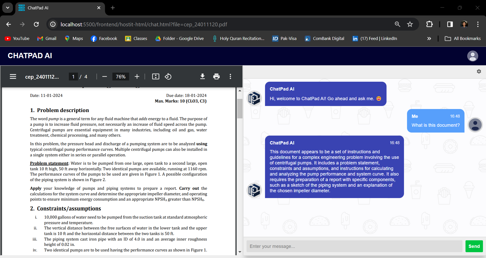
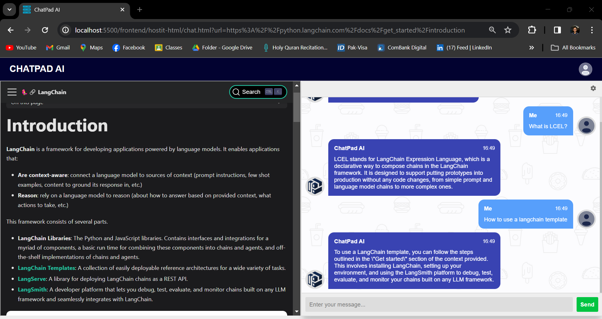

# ChatPad AI

Welcome to **ChatPad AI**, the web application that revolutionizes the way you interact with documents and web content! With ChatPad AI, you can upload a PDF or provide a URL, and engage in a natural conversation with the content. Whether you need to extract specific information, clarify complex topics, or simply explore a document in-depth, ChatPad AI makes it effortless and intuitive.


<div style="display: flex;">
    
    
</div>


## Features

- **AI-Powered PDF Interaction**: Upload a PDF and ask questions about its content, receiving intelligent responses as if you were chatting with an expert.
- **Dynamic URL Interaction**: Provide a URL and query the content of the web page, turning static information into an interactive dialogue.
- **Smart Follow-up Questions**: Continue the conversation with follow-up questions for deeper insights and comprehensive understanding.
- **Secure User Authentication**: Sign up and sign in to personalize your experience and keep your data secure.
- **User-Friendly Interface**: Enjoy a sleek, intuitive interface designed for seamless interaction and productivity.

## Getting Started

### Prerequisites

Ensure you have the following installed:

- Python 3.7 or higher
- pip (Python package installer)

### Installation

1. Clone the repository:
    ```bash
    git clone https://github.com/yourusername/ChatPad-AI.git
    cd ChatPad-AI
    ```

2. Create a virtual environment and activate it:
    ```bash
    python3 -m venv venv
    source venv/bin/activate
    ```

3. Install the required packages:
    ```bash
    pip install -r requirements.txt
    ```

### Configuration

1. Obtain an API key from OpenAI by signing up at [OpenAI](https://www.openai.com/).
2. Create a `.env` file in the root directory of the project and add your API key:
    ```plaintext
    OPENAI_API_KEY=your_openai_api_key
    ```

### Running the Application

1. Load the PDF and URL models:
    ```bash
    python model/pdf_loader.py
    python model/url_loader.py
    ```

2. Start the database server:
    ```bash
    python database/main.py
    ```

3. Launch the frontend:
    - Open the `frontend/index.html` file in your web browser.

4. Sign up or sign in to your account.
5. Upload a PDF or enter a URL and start chatting with the content!

## Project Structure

The project is organized into three main folders:

- **frontend**: Contains the web interface of the application.
- **database**: Manages the database and server-side logic.
- **model**: Includes scripts for loading and processing PDFs and URLs.

## Usage

### User Authentication

- **Sign Up**: Create a new account by providing your email and password.
- **Sign In**: Log in to your existing account using your email and password.

### Uploading a PDF

- Click on the "Upload PDF" button.
- Select the PDF file you want to interact with.
- Ask your questions in the chat interface.

### Providing a URL

- Enter the URL of the web page in the provided field.
- Click "Submit".
- Ask your questions in the chat interface.

### Asking Questions

- Type your question in the chat box and press "Enter" or click the "Send" button.
- The AI, powered by OpenAI's API, will process your question and provide an answer based on the content of the PDF or web page.
- Continue asking follow-up questions to get more detailed information.

## Contributing

We welcome contributions to ChatPad AI! Please follow these steps to contribute:

1. Fork the repository.
2. Create a new branch:
    ```bash
    git checkout -b feature/YourFeatureName
    ```
3. Make your changes and commit them:
    ```bash
    git commit -m 'Add some feature'
    ```
4. Push to the branch:
    ```bash
    git push origin feature/YourFeatureName
    ```
5. Open a pull request.

## Contact

For any questions or feedback, please open an issue or contact us at (mailto:abdhullahafthah@gmail.com).

---

Thank you for using ChatPad AI! Transform your document and web content interaction experience with the power of AI and OpenAI's API.
